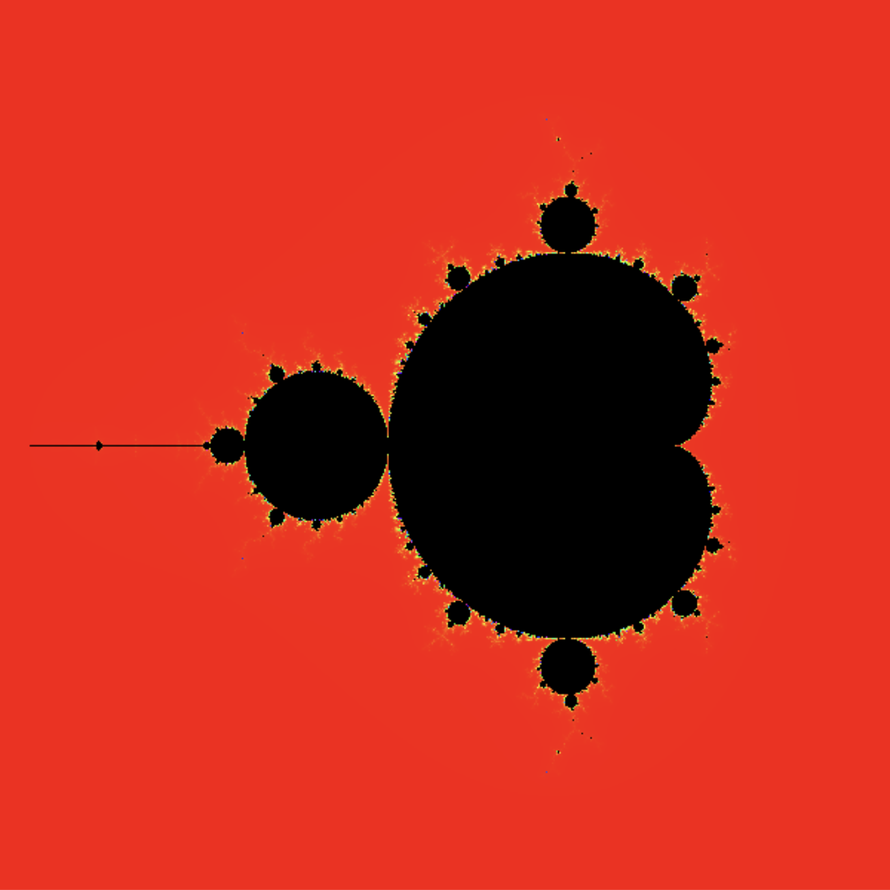
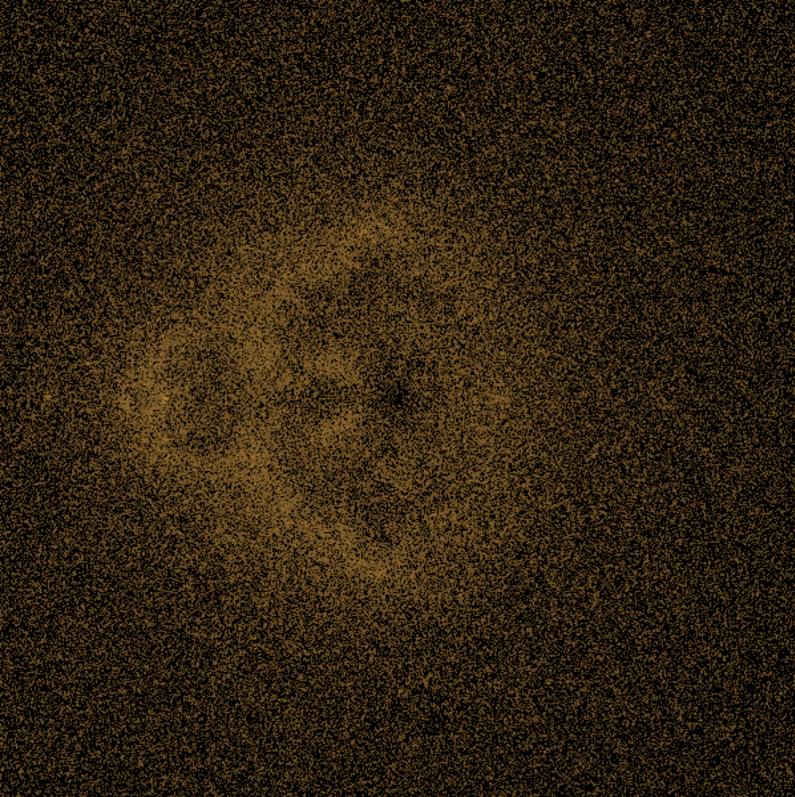

[](https://swiftpackageindex.com/Kosikowski/fractal-generators)
[](https://swiftpackageindex.com/Kosikowski/fractal-generators)

# FractalGenerators

A comprehensive Swift package for generating and displaying mathematical fractals with a modern, type-safe architecture.

## Overview

FractalGenerators provides a modular, extensible framework for creating mathematical fractals in Swift applications. The package includes over 40 different fractal types, from classic geometric fractals like the Mandelbrot Set to complex attractors and natural patterns.



### Features

- **40+ Fractal Types**: From geometric to algebraic, random to natural fractals
- **Type-Safe Architecture**: Compile-time parameter validation
- **High Performance**: Direct image generation with memory efficiency
- **Progressive Rendering**: Real-time preview with improving quality
- **Cross-Platform**: Works on macOS and iOS
- **Extensible**: Easy to add new fractal types
- **Async Support**: Non-blocking generation with progress callbacks



## Supported Fractal Types

### Geometric Fractals
- Sierpinski Triangle, Carpet, and Arrowhead
- Koch Snowflake
- Cantor Set and Cantor Dust
- Menger Sponge and Cube
- Dragon Curve and Heighway Dragon
- Hilbert Curve and Peano Curve
- Gosper Curve and Levy C Curve

### Algebraic (Escape-Time) Fractals
- Mandelbrot Set and Multibrot Sets
- Julia Set
- Burning Ship Fractal
- Tricorn (Mandelbar) Fractal
- Buddhabrot
- Newton Fractal

### Strange Attractors
- Lorenz Attractor
- Rössler Attractor
- Henon Attractor
- Clifford Attractor
- Chua's Circuit
- DeJong Attractor

### Random/Stochastic Fractals
- Brownian Motion
- Fractional Brownian Motion (FBM)
- Levy Flight
- Plasma Fractal
- Diamond-Square Algorithm
- Perlin Noise and Simplex Noise

### Natural Patterns
- Tree Branching
- River Networks
- Lightning Patterns
- Snowflakes
- Romanesco Broccoli
- Coastlines

### IFS (Iterated Function System)
- Barnsley Fern
- Apollonian Gasket
- Pythagorean Tree
- Fractal Flames

## Installation

### Swift Package Manager

Add FractalGenerators to your project dependencies:

```swift
dependencies: [
    .package(url: "https://github.com/Kosikowski/fractal-generators.git", from: "1.0.0")
]
```

### Requirements

- **Swift**: 5.10+
- **Platforms**: macOS 12.0+, iOS 15.0+
- **Dependencies**: swift-numerics (for complex number support)

## Quick Start

### Basic Usage

```swift
import SwiftUI
import FractalGenerators

struct ContentView: View {
    var body: some View {
        FractalFactory.createMandelbrot(iterations: 2000)
            .frame(width: 400, height: 400)
    }
}
```

### Parameterized Usage

```swift
struct FractalGalleryView: View {
    @State private var iterations: Double = 1000
    @State private var depth: Double = 6
    
    var body: some View {
        VStack {
            FractalFactory.createMandelbrot(iterations: Int(iterations))
                .frame(width: 300, height: 300)
            
            FractalFactory.createSierpinski(depth: Int(depth))
                .frame(width: 300, height: 300)
            
            Slider(value: $iterations, in: 100...5000)
            Slider(value: $depth, in: 1...10)
        }
    }
}
```

### Custom Generator

```swift
struct CustomFractalView: View {
    let generator = MandelbrotGenerator()
    let parameters = ComplexPlaneParameters(
        iterations: 1000,
        size: CGSize(width: 600, height: 600),
        viewRect: ComplexRect(Complex(-2.1, 1.5), Complex(1.0, -1.5)),
        blockiness: 0.5
    )
    
    var body: some View {
        GenericFractalView(generator: generator, parameters: parameters)
    }
}
```

## Architecture

The package uses a modular architecture with clear separation of concerns:

- **Generators**: Implement fractal generation logic
- **Parameters**: Type-safe parameter structures
- **Views**: Generic display components
- **Factory**: Convenient creation methods

For detailed architecture information, see [ARCHITECTURE.md](docs/ARCHITECTURE.md).

## Available Fractals

For a complete list of supported fractal types and their mathematical properties, see [FRACTAL_TYPES.md](docs/FRACTAL_TYPES.md).

## Examples

The package includes a comprehensive demo app showing all fractal types and usage patterns. See the `DemoApp/` directory for complete examples.

## API Reference

### Core Components

- `FractalGenerator`: Base protocol for all generators
- `ImageFractalGenerator`: For fractals that generate images
- `PathFractalGenerator`: For fractals that generate paths
- `PointFractalGenerator`: For fractals that generate point clouds
- `GenericFractalView`: Generic display component
- `FractalFactory`: Convenient creation methods

### Parameter Types

- `ComplexPlaneParameters`: For complex plane fractals
- `RecursiveFractalParameters`: For recursive fractals
- `AttractorParameters`: For attractor fractals

## Performance

The package is optimized for performance:

- **Direct Image Generation**: Returns `CGImage` instead of color arrays
- **Memory Efficiency**: No intermediate arrays
- **GPU-Friendly**: Raw pixel data for Metal/OpenGL
- **Progressive Rendering**: Low-res preview while computing high-res

## Contributing

We welcome contributions! Please see [CONTRIBUTING.md](docs/CONTRIBUTING.md) for guidelines.

## License

This project is licensed under the MIT License - see the LICENSE file for details.

## Documentation

- [Architecture Guide](docs/ARCHITECTURE.md) - Detailed architecture documentation
- [Fractal Types](docs/FRACTAL_TYPES.md) - Complete list of supported fractals
- [Examples](docs/EXAMPLES.md) - Usage examples and tutorials
- [API Reference](docs/API_REFERENCE.md) - Detailed API documentation

## Demo App

The package includes a comprehensive demo app in the `DemoApp/` directory that showcases all fractal types and demonstrates the architecture in action. 
